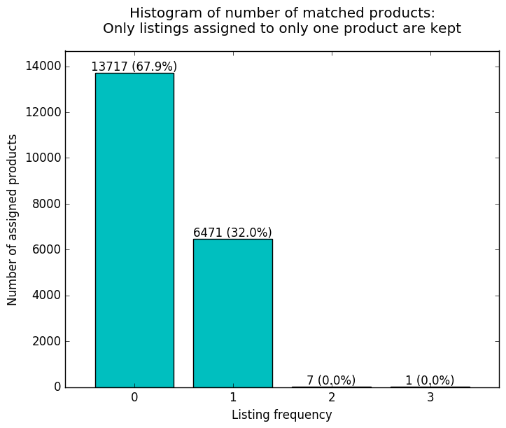

# Sortable Coding Challenge
This is my entry for the [Sortable Coding Challenge](http://sortable.com/challenge/).

Since the challenge is relatively open ended, my approach focuses on simplicity.

## Running
`sbt "run data/products.txt data/listings.txt results.txt"`

## Approach
For this kind of task it is often the case that a few good hand-crafted rules beat rather complex machine learning methods. If we assume that we want write code for use in production that needs to be adapted and maintained, then simpler and extensible methods are likely a better choice than very complex systems with a slightly better performance (of course there are exceptions). The machine learning approach also suffers from no labeled test set in this case, so we can't easily optimize an estimator.

Data exploration is key in this challenge. I have experimented with different rules and looked at the percentage of matches, negatives and positives. The code contains a set of rules that seem to work reasonable well.

There are many ways to make this better:
- Build a small data set with key examples in order to make iterations of experimentation and evaluation faster
- Try out more combinations of rules
- Use the rule-based method as a base-line to create labels and then use machine learning on top to improve the classification

## Assumptions
I make the following assumptions:
- If there are duplicates in the products (e.g. Samsung SL202) it is better to ignore the product because it is uncertain which one is correct (and we want to avoid errors at all costs).
- *"The task is to match each listing to the correct product."* I assume that a listing for a complement to a product (e.g. an accessory such as a battery or flash) should not be matched to the product, since it is technically a different product.
